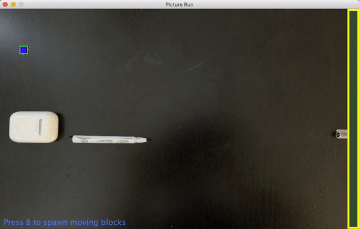
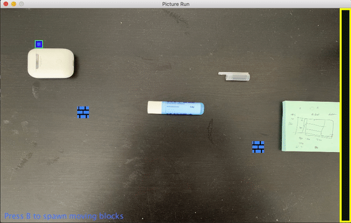

# Picture Run

This is a passion project I developed which caters to my love for platform games and sandbox games. I wanted to make a 
unique platform game which would offer users the ability to create their own levels and provide them with a unique
opportunity to merge the real world with this game. Users can build their own levels in the real world by placing 
objects onto a surface and snapping a picture of it then proceeding to play on this customized level in the game. 
This allows users to use their creativity to create fun, challenging and engaging levels for them to play.

### Visuals:

This project allowed me to learn a lot about graphics and visual components in Java. I enjoyed making aesthetic and 
engaging player models, block models, menu screens, etc. 

### Functionality:

- Images are flood filled using BFS according to a colour tolerance to mark the background of the images.
- Each identified object (platform) on the background is checked to assure that it is a valid platform and not a 
dust particle, blemish, etc.
- The image is analyzed to assure that the level is possible. In the case that it is not, moving blocks are rendered 
in to aid players in their quest to complete the level. 

### Examples:
Winning!

Losing :(

    
